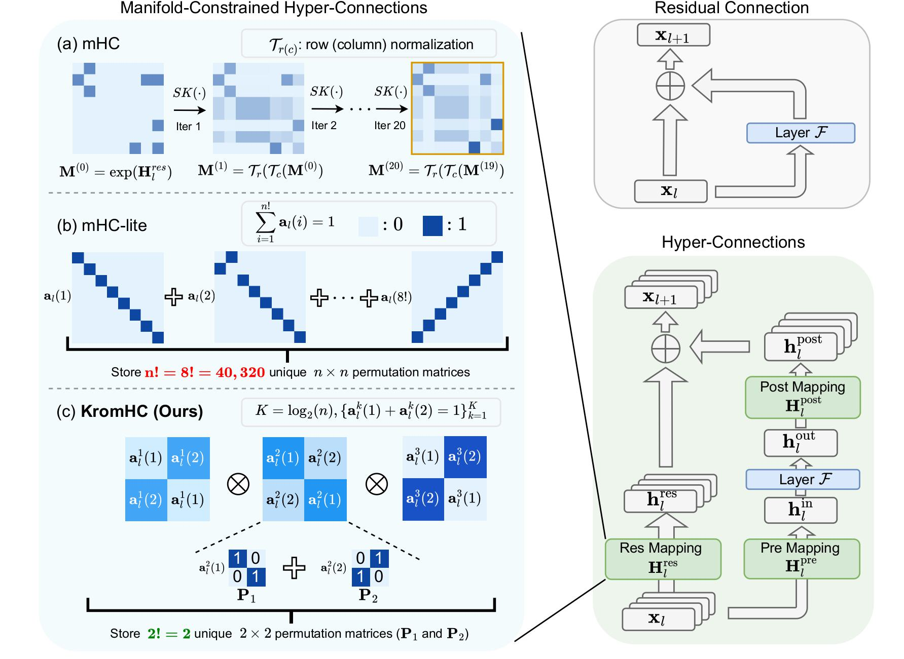

# KromHC: Manifold-Constrained Hyper-Connections with Kronecker-Product Residual Matrices

This repository contains the public implementation of [**KromHC: Manifold-Constrained Hyper-Connections with Kronecker-Product Residual Matrices**](https://www.arxiv.org/abs/2601.21579), a parameter-efficient variant of manifold-constrained hyper-connections (mHC) for training large language models. KromHC guarantees the double stochasticity of the residual matrices and doesn't require customized kernels.


## Overview

<p align="center">
  
</p>
<p align="center">
  <em>Figure 1: KromHC architecture overview</em>
</p>


Instead of having $n!$ permutation matrices as in mHC-lite, KromHC represents the mixing matrix $\mathbf{H}^{res}_l$ as the Kronecker products of multiple smaller (e.g., 2×2) doubly stochastic matrices. This guarantees the exact double stochasticity of the residual matrices while not having an explosion in parameter complexity.

### Methods

- **HyperConnection Variants**: 
  - `hyper_connections`: HyperConnections
  - `mHC`: Manifold-Constrained HyperConnections by DeepSeek
  - `mHC-lite`: A mHC variant which guarantees doubly stochastic residual matrices
  - `Kromhc`: Manifold-Constrained Hyper-Connections with Kronecker-Product Residual Matrices

## Citation

If you use this code in your research, please cite:

```bibtex
@article{zhou2026kromhc,
  title={KromHC: Manifold-Constrained Hyper-Connections with Kronecker-Product Residual Matrices},
  author={Wuyang Zhou and Yuxuan Gu and Giorgos Iacovides and Danilo Mandic},
  journal={arXiv preprint arXiv:2512.21572},
  year={2026}
}
```

## Acknowledgments

- We gratefully acknowledge the use of code from the following projects:   
    - [hyper-connections](https://github.com/lucidrains/hyper-connections)
    - [mHC-lite](https://github.com/FFTYYY/mhc-lite)

- This codebase has been designed to be compatible with the above two projects.

